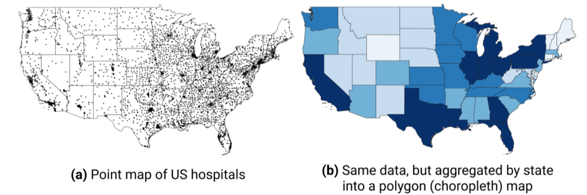
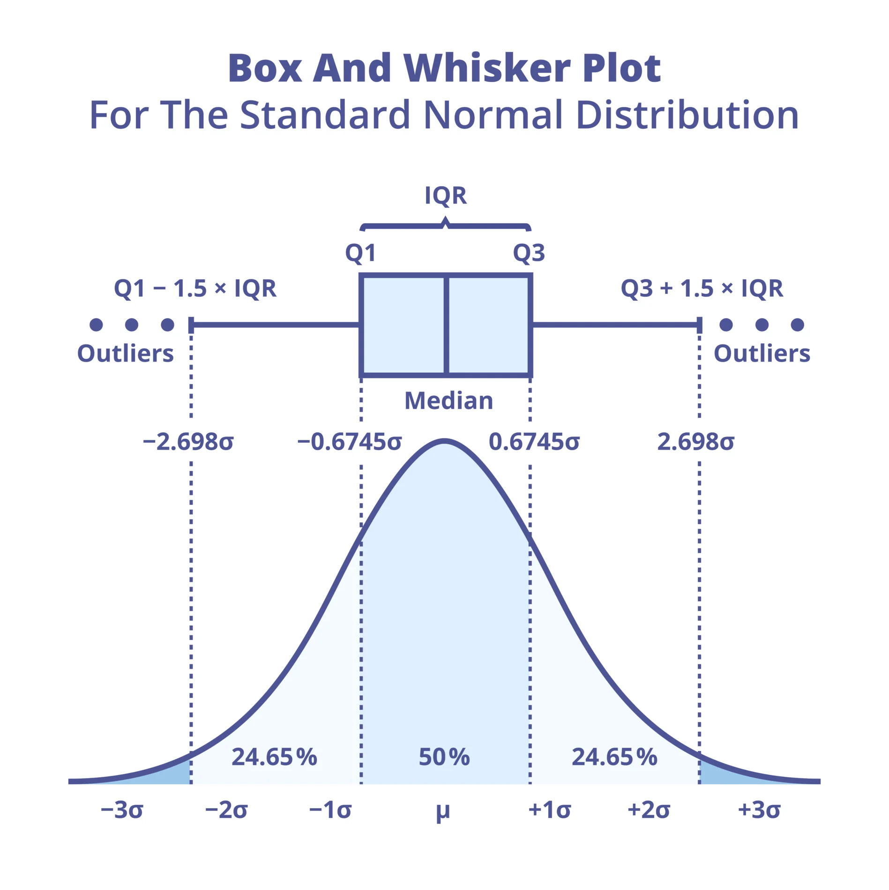
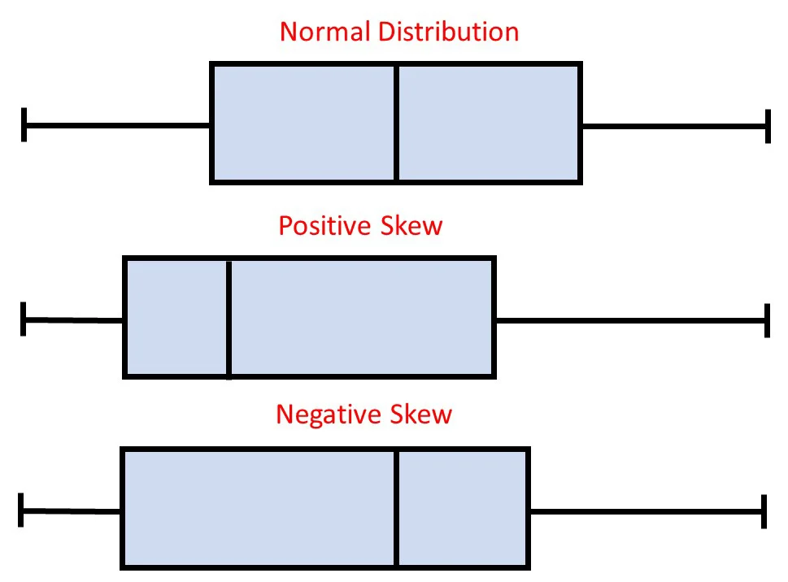



## Outline

* Measures of variability review
* Indexing
* Descriptives by group
* Visualizations: boxplots

## Reminder: Installing vs. Loading Packages

::: {style="font-size: 80%"}
Packages are add-ons that give R extra functions (e.g., `psych`, `ggplot2`). Using one is a **two-step** process:

:::: {.columns}
::: {.column .fragment}
#### Step 1: `install.packages("name")`

Downloads the package onto your computer

<div class="subpoint">○ Only need to do this **once** per computer </div>
<div class="subpoint">○ Package name goes in quotes </div>
<div class="subpoint">○ Needs an internet connection </div>

```{r}
#| eval: false
#| code-line-numbers: false
install.packages("psych")
```
:::

::: {.column .fragment}
#### Step 2: `library(name)`

Loads the package into your **current R session** so its functions are available

<div class="subpoint">○ Need to do this **every time** you open R / RStudio </div>
<div class="subpoint">○ Quotes are optional </div>
<div class="subpoint">○ Put it at the top of your script </div>

```{r}
#| eval: false
#| code-line-numbers: false
library(psych)
```
:::
::::

::: {.fragment}
Installing is like buying a book; `library()` is taking it off the shelf to read it.
Installing alone is **not enough**: without `library()`, you'll see `could not find function "describeBy"`.
:::
:::

## Measures of Variability Review

Describe the "spread" or "dispersion" of the data

```{r, echo=F}
#| fig-width: 4.5
#| fig-height: 3.5
#| layout-ncol: 3

hist(x = rnorm(1000, 0, .5),
     main = "low variance",
     xlab = "value",
     xlim = c(-4, 4),
     ylim = c(0, 350),
     breaks = 10)

hist(x = rnorm(1000, 0, 1),
     main = "standard",
     xlab = "value",
     xlim = c(-4, 4),
     ylim = c(0, 350),
     breaks = 10)

hist(x = rnorm(1000, 0, 2),
     main = "high variance",
     xlab = "value",
     xlim = c(-4, 4),
     ylim = c(0, 350),
     breaks = 10)
```

## Measures of Variability Functions

```{r}
testscores <- c(88, 93, 92, 99, 96)
```

Variance: `var(x)` function
<div class="subpoint">○ `x` = vector </div>

Standard Deviation: `sd(x)` function
<div class="subpoint">○ `x` = vector </div>

Interquartile Range: `IQR(x)` function
<div class="subpoint">○ `x` = vector </div>

<div class="subsubpoint">○ Difference between the 3rd and 1st quantile (so 50% of the data within this range) </div>
<div class="subsubpoint">○ 25% of the data lower than the 1st quantile </div>
<div class="subsubpoint">○ 75% of the data lower than the 3rd quantile </div>
<div class="subsubpoint">○ IQR = 3rd - 1st </div>

```{webr}
# let's look at some variances!
testscores <- c(88, 93, 92, 99, 96)

```

::: {.fragment}
Quantiles: `quantile()` function
:::

## Indexing

To access some subset of an object (vector, list, dataframe, etc.)

We already know one! The `$` operator indexes by selecting a column

```{r}
mydataframe <- data.frame(
  pet = c("cat", "dog"),
  count = c(2, 2))
```

```{webr}
mydataframe$pet
```

## Indexing

To access some subset of an object (vector, list, dataframe, etc.)

Can also use brackets `[]`

```{r}
myvector <- c(2, 4, 6, 8)

myvector[1]
```

Can select more than one position at a time

```{r}
myvector[c(1, 2, 3)]

myvector[1:3]
```

## Indexing

Need to account for multiple dimensions

Matrix: `[row, column]`

```{r}
mymatrix <- matrix(c(0, 1, 2,
                     1, 2, 3,
                     2, 3, 4),
                   nrow = 3, byrow = T,
                   dimnames = list(NULL, c("Var1", "Var2", "Var3")))
mymatrix
```

```{r}
mymatrix[2, ]

mymatrix[3, 2]
```

## Indexing

Dataframe: `[column]` or `[row, column]`

```{r}
mydataframe
```

:::: {.columns}
::: {.column .fragment}
```{r}
mydataframe[1]

mydataframe["pet"]

mydataframe$pet
```
:::
::: {.column .fragment}
```{r}
mydataframe[2, "pet"]
```

Can also do more than one element at a time:

```{r}
mydataframe[1:2, "count"]
```
:::
::::

## Descriptives by Group Visualization

Why visualize aggregated data?
<div class="subpoint">○ Makes group-level insights easier to interpret. </div>
<div class="subpoint">○ Highlights patterns, trends, and outliers in grouped data </div>
<div class="subpoint">○ Helps communicate findings effectively </div>



## Descriptives by Group

Aggregation involves summarizing or grouping data based on certain variables.

Commonly used to calculate summary statistics like mean, variance, or sum for each group.

:::: {.columns}
::: {.column .fragment}
Benefits:
<div class="subpoint">○ Data summary </div>
<div class="subpoint">○ Data simplification </div>
<div class="subpoint">○ Statistical analysis </div>
<div class="subpoint">○ Trend identification </div>
<div class="subpoint">○ Data privacy </div>
<div class="subpoint">○ Data-driven decisions </div>
:::

::: {.column .fragment}
`aggregate(y ~ group, FUN)`
<div class="subpoint">○ `y` = vector we want statistics for </div>
<div class="subpoint">○ `group` = vector with grouping data </div>
<div class="subpoint">○ `FUN` = function to apply </div>
:::
::::

## Descriptives by Group Example

```{webr}
# average Sepal Length by iris species?


```

## Descriptives by Group: `table()` and `describeBy()`

:::: {.columns style="font-size: 70%"}
::: {.column .fragment}
**Crosstab (counts): `table(var1, var2)`**
<div class="subpoint">○ `var1` = rows, `var2` = columns (both categorical) </div>

```{r}
#| code-line-numbers: false
iris$Size <- cut(iris$Sepal.Length,
                 breaks = c(0, 5.8, 10),
                 labels = c("Short", "Long"))

table(iris$Species, iris$Size)
```
:::

::: {.column .fragment}
**All descriptives at once: `describeBy(x, group)`**
<div class="subpoint">○ From the `psych` package: `install.packages("psych")` </div>
<div class="subpoint">○ `x` = numeric vector, `group` = grouping vector </div>
<div class="subpoint">○ Add `mat = TRUE` for one compact table </div>

```{r}
#| code-line-numbers: false
library(psych)

describeBy(iris$Sepal.Length, iris$Species,
           mat = TRUE)[, c("group1", "n", "mean",
                           "sd", "median")]
```
:::
::::

::: {.fragment}
```{webr}
# Your turn: crosstab Species by Size, then describe Petal.Width by Species
library(psych)
iris$Size <- cut(iris$Sepal.Length, breaks = c(0, 5.8, 10), labels = c("Short", "Long"))

```
:::

## Visualizations: Boxplots

:::: {.columns}

::: {.column}
Back to the `iris` dataset, distribution of Sepal Length by species

Anatomy of a boxplot:
<div class="subpoint">○ "Minimum" </div>
<div class="subpoint">○ 25th Quantile (Q1) </div>
<div class="subpoint">○ Median </div>
<div class="subpoint">○ 75th Quantile (Q3) </div>
<div class="subpoint">○ "Maximum" </div>
<div class="subpoint">○ Points representing outliers </div>

:::

::: {.column style="font-size:70%"}
```{r, echo = F}
#| fig-width: 5
#| fig-height: 3
library(ggplot2)

ggplot(iris, aes(x = Sepal.Length, fill = Species)) +
  geom_boxplot(color = "black") +
  theme_classic()

```
"Minimum" and "maximum" are not the *true* min and max
<div class="subpoint">○ Minimum: $Q1 - 1.5 * IQR$ </div>
<div class="subpoint">○ Maximum: $Q3 + 1.5 * IQR$ </div>
Means that the whiskers contain \~99% of the data, rest are outliers
:::
::::

::: footer
For more explanation of the anatomy of a boxplot, feel free to check [this post out from Statistics by Jim](https://statisticsbyjim.com/graphs/box-plot/)
:::

## Visualizations: Boxplots

One more resource for boxplot anatomy

{fig-align="center" width=400}

::: footer
[https://www.simplypsychology.org/boxplots.html](https://www.simplypsychology.org/boxplots.html)
:::

## Visualizations: Boxplot

{fig-align=center}


## Let's Do Some Visualization

### Base R Graphics: Boxplot

:::: {.columns}
::: {.column}
`boxplot(x)` function

Its arguments are:

<div class="subpoint">**Required arguments:** </div>
<div class="subsubpoint">○ `x` = vector (variable) you want to plot </div>
<div class="subpoint">**Optional arguments:** </div>
<div class="subsubpoint">○ `main` = title </div>
<div class="subsubpoint">○ `xlab` = label for x-axis </div>
<div class="subsubpoint">○ `ylab` = label for y-axis </div>
<div class="subsubpoint">○ `border` = color for bar borders </div>
<div class="subsubpoint">○ `col` = color for bars </div>
<div class="subsubpoint">○ `horizontal` = `T`/`F` to switch </div>
:::

::: {.column}
```{webr}
boxplot(iris$Sepal.Length,
     main = "Boxplot of Sepal Length",
     xlab = "Sepal Length",
     border = "gray35",
     col = "skyblue")
```
:::
::::
## Let's Do Some Visualization

### Base R Graphics: Boxplot

:::: {.columns}
::: {.column}
To group them, you can change the `x` to a "formula"

`outcome_var ~ group_var`

Just like we saw with `aggregate()`
:::

::: {.column}
```{webr}
boxplot(iris$Sepal.Length ~ iris$Species,
     main = "Boxplot of Sepal Length by Species",
     xlab = "Sepal Length",
     border = "gray35",
     col = "skyblue")
```
:::
::::


## Where Does R Look for Files? The Working Directory

::: {style="font-size: 70%"}
When you write `read.csv("student_data.csv")`, R reads it as: *"look for `student_data.csv` inside the current working directory"*

:::: {.columns}
::: {.column .fragment}
**Rule for beginners**

> Your R Markdown file and all required data files should be placed in the **same assignment folder** before you begin working.

```
Lab_03/
├── Lab_03.Rmd
└── student_data.csv
```

Then loading the data only needs the file name:

```{r}
#| eval: false
#| code-line-numbers: false
student_data <- read.csv("student_data.csv")
```
:::

::: {.column .fragment}
**Check before you load data**

```{r}
#| eval: false
#| code-line-numbers: false
getwd()        # which folder is R looking in?
list.files()   # which files can R see there?
```

If the setup is correct you should see something like:

```
[1] "/Users/yourname/Documents/Lab_03"
[1] "Lab_03.Rmd"  "student_data.csv"
```

<div class="subpoint">○ Tip: when you knit an `.Rmd`, the working directory is the folder the `.Rmd` is saved in </div>
:::
::::
:::

## The Common Mistake

::: {style="font-size: 75%"}
:::: {.columns}
::: {.column .fragment}
**Files downloaded to different places**

```
Downloads/
└── Lab_03.Rmd

Desktop/
└── student_data.csv
```

The working directory is `Downloads`, so this fails:

```{r}
#| eval: false
#| code-line-numbers: false
read.csv("student_data.csv")
```

```
Error in file(file, "rt") : cannot open the connection
In addition: Warning message:
  cannot open file 'student_data.csv': No such file or directory
```
:::

::: {.column .fragment}
**What the error means**

R looked in the working directory but did not find a file with that exact name.

**The fix**

<div class="subpoint">○ Move both files into the same folder (e.g., `Lab_03/`) </div>
<div class="subpoint">○ Open the `.Rmd` from *that* folder </div>
<div class="subpoint">○ Re-run `getwd()` and `list.files()` to confirm </div>

<br>

Fix the **folder**, not the code: don't keep rewriting the path in `read.csv()`.

Also check the exact file name: `Student_Data.csv` ≠ `student_data.csv`
:::
::::
:::

## Lab Assignment 3!
- Create a folder for the assignment for your convenience

- Have the rmd. and the dataset for the assignment on the same folder 

- Submit both the rmd. and the knitted file

